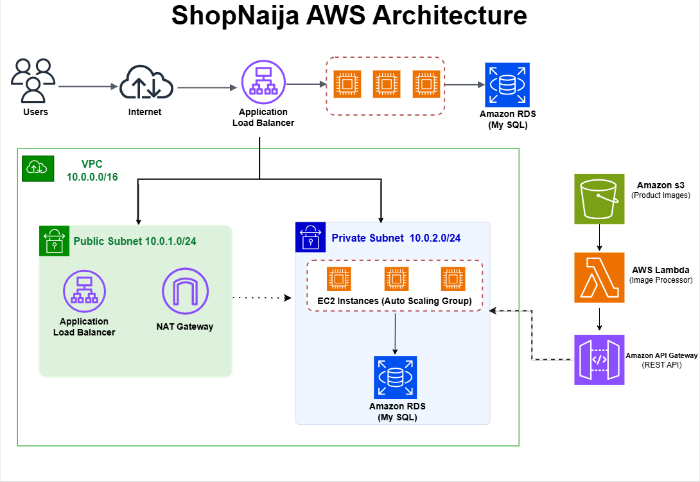

# ShopNaija Cloud Infrastructure with Terraform

# ShopNaija Cloud Infrastructure on AWS

Production-ready cloud infrastructure deployed using Terraform on AWS.

## Architecture Diagram

<p align="center">
 
</p>

## Architecture Overview

The ShopNaija infrastructure is built using a modular Terraform architecture following AWS best practices.

The solution consists of:

- Amazon VPC
- Public and Private Subnets
- Internet Gateway
- NAT Gateway
- Application Load Balancer
- EC2 Auto Scaling Group
- Amazon RDS (MySQL)
- Amazon S3
- AWS Lambda
- Amazon API Gateway
- Amazon CloudWatch
- IAM Roles and Instance Profiles

## Request Flow

1. Users access the application through the Internet.
2. Traffic is routed to the Application Load Balancer.
3. The Load Balancer distributes requests across EC2 instances.
4. EC2 instances communicate with the Amazon RDS database.
5. Product images are stored in Amazon S3.
6. Image processing is handled by AWS Lambda.
7. API requests are exposed through Amazon API Gateway.
8. CloudWatch monitors the infrastructure and application performance.

## Project Overview

This project provisions a secure, scalable, and highly available cloud infrastructure for **ShopNaija**, a growing e-commerce startup, using **Terraform** on **Amazon Web Services (AWS)**.

The infrastructure follows Infrastructure as Code (IaC) principles by automating the provisioning of AWS resources through reusable Terraform modules.

## Architecture

The architecture consists of:

- Amazon VPC
- Public and Private Subnets
- Internet Gateway
- NAT Gateway
- Route Tables
- Security Groups
- Application Load Balancer (ALB)
- EC2 Auto Scaling Group
- Amazon RDS (MySQL)
- Amazon S3
- AWS Lambda
- Amazon API Gateway
- Amazon CloudWatch
- AWS IAM

> Insert the architecture diagram here.


## Architecture Flow

```
Users
    │
Internet
    │
Application Load Balancer
    │
EC2 Auto Scaling Group
    │
Amazon RDS

Amazon S3
    │
AWS Lambda
    │
API Gateway

CloudWatch

IAM
```

# AWS Services Used

| Service | Purpose |
|----------|---------|
| Amazon VPC | Network isolation |
| Public Subnets | Internet-facing resources |
| Private Subnets | Secure backend resources |
| Internet Gateway | Internet connectivity |
| NAT Gateway | Outbound internet for private resources |
| Security Groups | Firewall rules |
| Application Load Balancer | Traffic distribution |
| EC2 Auto Scaling Group | Highly available web servers |
| Amazon RDS | Managed MySQL database |
| Amazon S3 | Object storage |
| AWS Lambda | Serverless processing |
| API Gateway | REST API endpoint |
| CloudWatch | Monitoring and logging |
| IAM | Identity and Access Management |

# Project Structure

```
shopnaija-cloud-infrastructure/
│
├── terraform/
│   ├── modules/
│   │   ├── alb/
│   │   ├── api_gateway/
│   │   ├── cloudwatch/
│   │   ├── compute/
│   │   ├── iam/
│   │   ├── lambda/
│   │   ├── rds/
│   │   ├── s3/
│   │   ├── security_groups/
│   │   └── vpc/
│   │
│   ├── lambda/
│   ├── scripts/
│   ├── backend.tf
│   ├── main.tf
│   ├── outputs.tf
│   ├── provider.tf
│   ├── terraform.tfvars
│   ├── variables.tf
│   └── versions.tf
│
├── .gitignore
└── README.md
```

# Features

- Modular Terraform Architecture
- Infrastructure as Code
- High Availability
- Auto Scaling
- Secure Networking
- Managed Database
- Serverless Functions
- Monitoring
- Logging
- Scalable Storage

# Prerequisites

- Terraform >= 1.5
- AWS CLI
- AWS Account
- Git
- GitHub

# Clone Repository

```bash
git clone https://github.com/abayomikissiba-ux/shopnaija-cloud-infrastructure.git

cd shopnaija-cloud-infrastructure/terraform
```

# Initialize Terraform

```bash
terraform init
```

# Format Code

```bash
terraform fmt -recursive
```

# Validate Configuration

```bash
terraform validate
```

# Review Deployment Plan

```bash
terraform plan
```

# Deploy Infrastructure

```bash
terraform apply
```

# Destroy Infrastructure

```bash
terraform destroy
```

# Security Features

- Private subnets for backend services
- Security Groups with least privilege
- IAM Roles for EC2 and Lambda
- Private RDS database
- No direct internet access to EC2
- HTTPS support through Application Load Balancer

# Monitoring

Amazon CloudWatch provides:

- Lambda Logs
- EC2 CPU Monitoring
- CloudWatch Alarms
- Application Monitoring

# Cost Optimization

The infrastructure uses cost-conscious AWS services suitable for a student project:

- t3.micro EC2 instances
- db.t3.micro Amazon RDS
- GP3 EBS volumes
- Auto Scaling
- Amazon S3 Lifecycle Policies
- Serverless Lambda
- Managed CloudWatch log retention

# Disaster Recovery

- Amazon RDS automated backups
- Multi-AZ support (optional)
- Amazon S3 versioning
- Infrastructure recreation using Terraform
- GitHub source control

# Challenges Encountered

- Terraform module dependencies
- IAM role configuration
- Auto Scaling integration
- Git branch management
- AWS provider configuration
- Lambda packaging
- API Gateway integration

# Lessons Learned

Through this project, I gained hands-on experience in:

- Infrastructure as Code
- Terraform Modules
- AWS Networking
- Security Best Practices
- Load Balancing
- Auto Scaling
- Serverless Computing
- Monitoring
- Version Control with Git and GitHub


# Future Improvements

- AWS WAF
- Amazon CloudFront
- AWS Secrets Manager
- Route 53
- SSL Certificate using ACM
- CI/CD with GitHub Actions
- Multi-Region Deployment
- Containerization with ECS or EKS


# Author

**Abayomi Emmanuel Kissiba**

Cloud Computing Mentee (M4ACE)

GitHub: https://github.com/abayomikissiba-ux


# License

This project is for educational purposes.